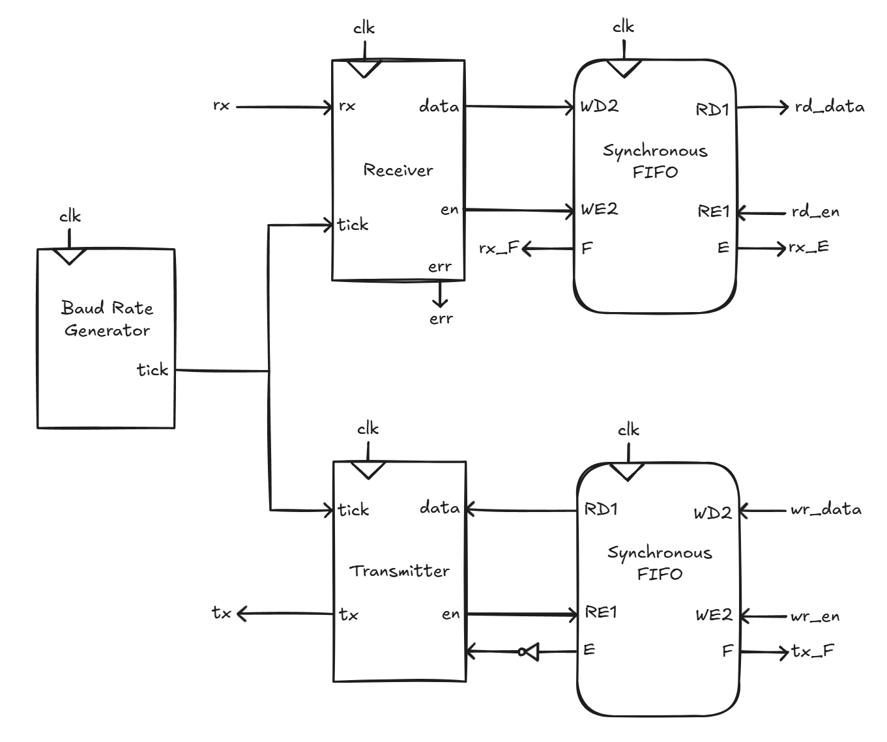

# UART Core

A UART (Universal Asynchronous Receiver/Transmitter) implemented in SystemVerilog with independent TX and RX FIFOs. The device uses an 8N1 bit frame, a 16x oversampling sequence, and has a configurable baud rate. Framing errors are flagged if the line isn't held at the expected stop bit position. TX and RX synchronous FIFOs have a depth of 64 and a width of 8 bits, and include overflow and underflow protection.

## Datapath Diagram


## Project Structure
```
uart-core/

├── data/         # Numeric input data

├── images/       # UART diagram

├── scripts/      # Python scripts

├── src/          # Main SystemVerilog source files

├── tb/           # Testbench files
```

## Installation

### 1. Prerequisites
- **Questa** (included with Quartus Prime Lite)

### 2. Clone the Repository
```bash
git clone https://github.com/tebsjejsn/uart-core.git
cd uart-core
```

## Running the Project

### 1. Program Setup
- Open the repository in Visual Studio Code to browse and edit source files.
- Launch Questa, find the transcript window, and change the working directory to the folder of uart-core

### 2. Compilation
> Run the following in the Questa transcript window (this is Tcl syntax, not a shell command)
```
vlib work
vmap work work
vlog -sv {*}[glob src/*.sv] {*}[glob tb/*.sv]
```

### 3. Load the Testbench
```
vsim -voptargs="+acc" work.tb
```

### 4. Run the Simulation
- Go to the sim window, right-click module named "tb", and select Add > To Wave > All items in region
- Type run -all in the Questa transcript window

## (Optional) Add Unique Operations/Operands

### 1. Insert New Data
- Add new bytes to data/inputs.txt, or use generate.py to produce a random data sequence:
```bash
python3 scripts/generate.py
```
- Compare data/outputs.txt against data/inputs.txt after the run to confirm the received bytes match what was sent

### 2. Repeat Steps
- Follow the previous steps to run the simulation

## License
Distributed under the MIT License. See `LICENSE` for more information..